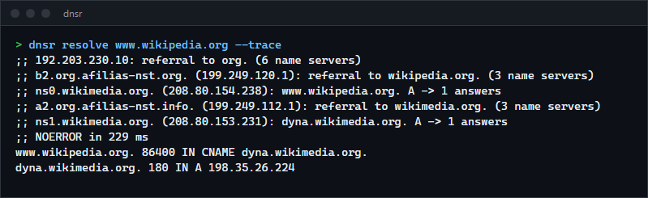
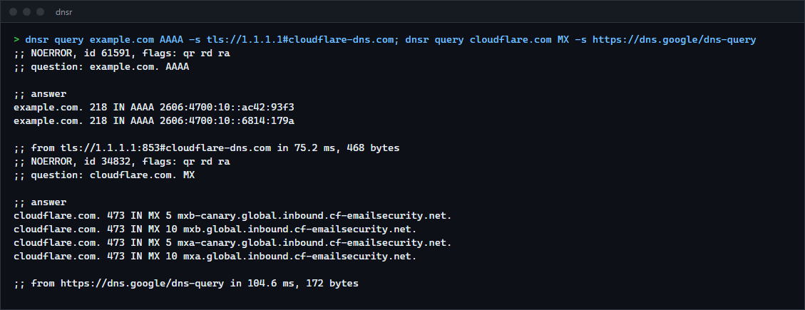

# dnsr

An authoritative DNS server and a caching resolver in one program, with a `dig`-like query tool. It serves zones from standard zone files and answers everything else by resolving from the root servers itself or by forwarding over DNS over TLS or DNS over HTTPS. For anyone running DNS for a home lab or a small network, and for reading how DNS works: every part (wire format, zone files, the authoritative algorithm, iterative resolution, the cache) is written here, without a DNS library.

**Status:** v0.1.0, working on Windows. The code is portable but was only run on Windows 11. Not published to crates.io; build from source.



## Features

- **Authoritative server** for any number of zones, over UDP and TCP: CNAME chains, wildcards (RFC 4592), delegations with glue, DS at the parent side of a cut, empty non-terminals, negative answers with the SOA and its negative TTL (RFC 2308), EDNS (RFC 6891) with answers truncated to fit and the TC bit set, and zone transfers (AXFR) to allowed addresses.
- **Zone files** in the standard format: `$ORIGIN`, `$TTL`, relative names and `@`, blank owners, parentheses, comments, quoted strings with escapes, TTL units (`1h30m`), and the generic `\# length hex` form for any type. The common types are understood (A, AAAA, NS, CNAME, SOA, PTR, MX, TXT, SRV, CAA, HINFO) and the DNSSEC types are read and served (DS, DNSKEY, RRSIG, NSEC, ZONEMD), so a signed zone such as the root zone loads unchanged.
- **Recursive resolver** that starts at the root servers and follows referrals, resolves name server names that come without glue, follows CNAMEs across zones, skips servers that do not answer, and only believes records inside the zone of the server that sent them.
- **Forwarding resolver** over UDP, TCP, DNS over TLS (RFC 7858) or DNS over HTTPS (RFC 8484), with TLS connections kept open and reused.
- **Cache** with TTLs that count down, negative caching, a size limit, and trust ranks so glue never replaces a real answer and is never given to a client.
- Random query IDs and source ports from the system's secure random generator; answers must match the query's ID, question and server.
- **Query tool** (`dnsr query`) for all four transports and AXFR, a one-shot resolver with a step-by-step trace (`dnsr resolve --trace`), and a zone checker (`dnsr check`).

## How to install

Requires a recent stable Rust (built and tested with 1.98.1) and a C compiler for the `ring` crate (on Windows, the Visual Studio build tools).

```sh
git clone https://github.com/r3clusionn/dns
cd dns
cargo install --path .
```

This installs the `dnsr` binary.

## How to use

### Serving

```sh
# An authoritative server for one zone on port 5353 (port 53 needs administrator rights).
dnsr serve --listen 127.0.0.1:5353 --zone example.com=example.com.zone

# Add a resolver for everything else, for clients on the local network.
dnsr serve --listen 0.0.0.0:53 --zone home.lan=home.lan.zone --recursive --allow 192.168.0.0/16 --allow 127.0.0.0/8

# A forwarding resolver that sends everything to Cloudflare over TLS and Google over HTTPS.
dnsr serve --forward tls://1.1.1.1#cloudflare-dns.com --forward https://dns.google/dns-query
```

Recursion is only offered to loopback clients unless `--allow` says otherwise, so a server on a public address does not become an open resolver by accident. Zone transfers are allowed from loopback only.

The same in a configuration file (`dnsr serve --config dnsr.toml`):

```toml
listen = ["0.0.0.0:53", "[::]:53"]
threads = 8
allow_transfer = ["127.0.0.1", "192.168.1.2"]

[[zone]]
origin = "home.lan"
file = "zones/home.lan.zone"

[resolver]
mode = "forward"                  # or "recursive"
upstreams = ["tls://1.1.1.1#cloudflare-dns.com", "tls://9.9.9.9#dns.quad9.net"]
allow = ["127.0.0.0/8", "192.168.0.0/16", "::1"]
cache_size = 100000               # entries
max_ttl = 86400                   # seconds
ipv6 = false                      # use IPv6 addresses of name servers (recursive mode)
```

### Querying

```sh
dnsr query example.com                                   # A from 127.0.0.1
dnsr query example.com MX -s 9.9.9.9
dnsr query example.com AAAA -s tls://1.1.1.1#cloudflare-dns.com
dnsr query example.com TXT -s https://dns.google/dns-query
dnsr query home.lan AXFR -s tcp://127.0.0.1:5353
dnsr resolve www.wikipedia.org --trace                   # resolve from the root, showing each step
dnsr check example.com.zone --print                      # load a zone, report problems, print it
```

Server forms for `-s` and `--forward`: `1.1.1.1` or `udp://1.1.1.1:53`, `tcp://...`, `tls://ADDRESS#NAME` (the name the certificate must carry; `tls://dns.google` looks the address up) and `https://HOST/PATH`.



## How it works

- **Wire format.** Names are decoded with every compression pointer required to point strictly backwards from where the name started, which makes loops impossible without a hop counter, and with the 255-byte limit checked as labels arrive. Encoding compresses names in the record types of RFC 1035 and, as RFC 3597 and RFC 2782 require, never in later types (SRV targets, RRSIG signers, NSEC next names). Truncation drops whole records from the end and keeps the EDNS record; dropping only additional records does not set TC (RFC 2181 section 9).
- **Zones** are maps from names to record sets kept in DNSSEC canonical order (RFC 4034 section 6.1). In that order a name's descendants come right after it, so "does anything exist below this name" (an empty non-terminal) is one range lookup. Signatures are stored per covered type, each with its own TTL.
- **Answers** follow RFC 1034 section 4.3.2: look for a zone cut between the apex and the name (a referral), then the name itself (data, a CNAME to follow inside the zone, or no data), then the closest encloser and its wildcard (RFC 4592), and only then NXDOMAIN.
- **Resolution.** The resolver starts from the deepest zone whose name servers are cached (the root otherwise), asks one of that zone's servers without recursion, and either gets the answer, a negative answer, or a referral one level down. Records are only believed for names inside the zone the server was asked as, and glue only for names inside that zone, which is what stops a server for `evil.test` from planting an address for `www.example.test` (both are tested). Name servers without glue are resolved first, at most five levels deep.
- **The cache** ranks data by where it came from (RFC 2181 section 5.4.1): glue, referral NS records, and answers. Clients only get answers; better-ranked data is never replaced by worse while it is valid.
- **The server** reads UDP on one thread per socket and hands queries to a pool of workers; TCP gets a thread per connection (up to 256), several queries per connection and a 10 second idle timeout.

## Measurements

Intel Core i9-14900KF (24 cores, 32 threads), 32 GB, Windows 11, Rust 1.98.1, release build. Everything over loopback.

**Throughput** against CoreDNS 1.14.7 (the official Windows build), with `scripts/bench.py`: the load generator in `examples/loadgen.rs` keeps 8 x 32 queries in flight for 10 seconds, asking for 10,000 different names; four rotated rounds, median. Both servers answered every query correctly (no losses, no wrong answers).

| | dnsr (8 worker threads) | CoreDNS |
|---|---|---|
| Authoritative, zone of 10,003 records | 625,000 answers/s, p50 0.40 ms, p99 0.54 ms | 157,000 answers/s, p50 1.54 ms, p99 4.9 ms |
| Cached answers, forwarding resolver | 679,000 answers/s, p50 0.36 ms, p99 0.59 ms | 125,000 answers/s, p50 1.96 ms, p99 5.1 ms |
| CPU time per 100,000 answers (authoritative / cached) | 1.43 s / 1.29 s | 2.60 s / 2.37 s |

CoreDNS is mostly run on Linux, where its UDP path is different; this compares the two on Windows only.

**Zone loading:** the IANA root zone (2.2 MB, 24,911 records with DNSSEC) loads in 46 ms.

**Resolving real names** (`scripts/compare_resolvers.py`, 203 names over a home connection): from a cold cache the median answer took 95 ms (90th percentile 312 ms); asked again, answers came from the cache in a median of 0.22 ms.

## Verification

- `cargo test --release`: 44 tests (19 unit tests, 4 of authoritative answers, 11 of the resolver, 6 of the server over sockets, 4 of the wire format against damaged input). Clippy reports nothing.
- **Zone files against dnspython.** `scripts/check_zone.py` loads a zone with dnsr and with dnspython 2.8 and compares every record in wire format. The IANA root zone: all 24,911 records identical (this found that signatures covering different types need their own TTLs). `tests/zones/tricky.zone` (escapes, `$ORIGIN` changes, TTL units, quoted semicolons, generic types, DS, CAA, SRV): all 30 identical.
- **Wire format against dnspython.** `scripts/check_wire.py` makes 20,000 random messages with dnspython (15 record types, names drawn from a few labels in mixed case so compression has work to do, EDNS on and off), and dnspython reads dnsr's re-encoding of each back as the same message: 20,000 of 20,000. dnsr's encoding is the same size or smaller for 82% of them; every larger one contains an SRV record, whose target dnspython compresses and RFC 2782 says not to.
- **Hostile input.** 200,000 random byte strings and 200,000 damaged real messages (bit flips, cuts, inserted bytes) never panic the decoder, and whatever decodes survives a second round trip unchanged; every truncation of a valid message is rejected.
- **Authoritative answers.** The example zone and all eight example queries of RFC 4592 section 2.2.1 (wildcards that apply and that must not), plus CNAME chains, loops and dangling targets, empty non-terminals, negative TTLs, glue and DS at a cut.
- **Resolution** against a DNS tree on loopback (a root server, a server for `test.`, servers below it, a dead one and a hostile one, all on 127.0.0.x): referrals from the root, everything cached on the second query, TTLs counting down and expiring, NXDOMAIN and NODATA cached, a CNAME into a zone whose name server has no glue, a dead server skipped, and a server for `evil.test` that plants records for `www.example.test` in its answers and in its glue: none of them are cached. Forged UDP answers (wrong ID, wrong question) sent before the real one are ignored.
- **The server over sockets:** truncation without EDNS (512 bytes) and with it (capped at 1,232), the client's fall back to TCP, a zone transfer of 3,000 records over several messages, transfers and recursion refused to other addresses, FORMERR, NOTIMP and BADVERS, no answer to answers, several queries on one TCP connection, and an idle client dropped.
- **Breaking the checks on purpose.** `scripts/mutate.py` disables 20 checks one at a time (pointer direction, ID and question matching, bailiwick for answers and for glue, cache ranks and expiry, CNAME loop detection, zone cuts, empty non-terminals, negative TTLs, DS at the cut, transfer restrictions, and more) and runs the tests. 19 are caught. The one that is not removes the 255-byte check while a compressed name is being read, and it changes nothing: the finished name is checked again when it is built. The first run of this found three checks with no test (trailing bytes, CNAME loops in the resolver, and the resolver's own cap on negative TTLs); writing the test for the last one found a real bug: the resolver cached the capped TTL but handed the client the SOA with its full TTL.
- **Live comparison with Cloudflare.** For 203 real names (`scripts/domains.txt`), `dnsr serve --recursive` and 1.1.1.1 agree on the response code, and on whether there are addresses, for 202. Address sets were identical for 165; the rest are sites that hand out different addresses per query or location. The one difference is a name that does not exist under `example.com`: Cloudflare's own name servers answer NXDOMAIN to a query without DNSSEC, which dnsr passes on, while public resolvers ask with the DNSSEC OK bit and receive Cloudflare's NOERROR-with-NSEC denial instead.

## Limits

- **No DNSSEC validation.** Signed data is carried and served, but signatures are not checked, and the DO and AD bits are not acted on.
- **No QNAME minimisation** (RFC 9156): the full name is sent to every server on the way down, including the root.
- No IXFR, NOTIFY, dynamic updates or secondary zones; zones are loaded at start and not reloaded.
- DNS over TLS and HTTPS are client side only (for forwarding and `query`); the server listens on plain UDP and TCP.
- No response rate limiting; keep recursion limited to your own networks (the default is loopback only).
- In recursive mode only the IPv4 addresses of name servers are used unless `ipv6 = true`.
- The cache is in memory and starts empty at every start.
- Tested on Windows 11 only.

## License

MIT (see `LICENSE`).
